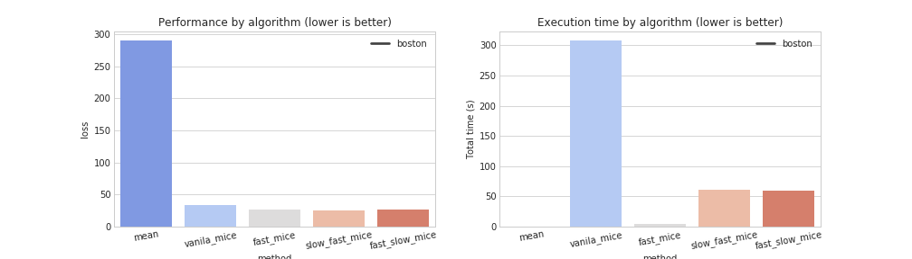
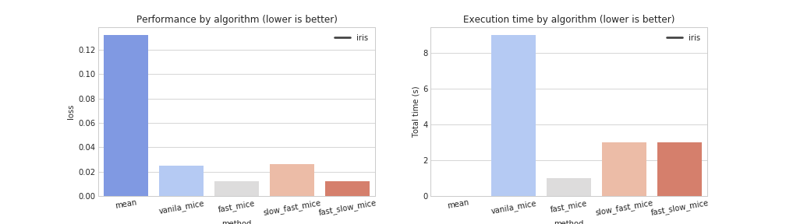
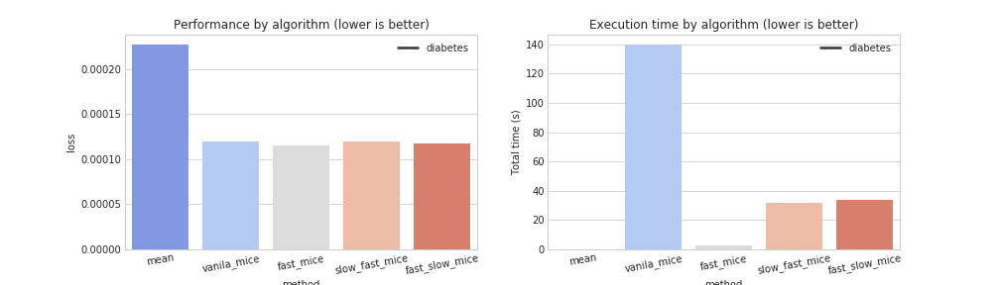
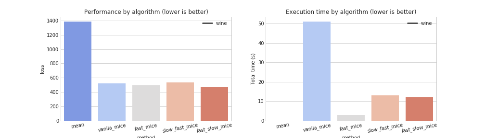
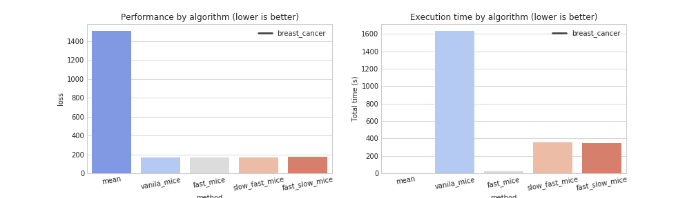

# Benchmark of Multiple Imputation using Chained Equations (MICE) algorithm

This repo contains a benchmark of the MICE algorithm regarding performance and execution time for imputing missing values on data.
For this purpose, several variations of the MICE algorithm have been implemented using [LightGBM](https://github.com/Microsoft/LightGBM) instead of linear models for value imputation for accuracy and speed improvements. Here, four method are evaluate against the mean / mode value imputation procedure for multi-dimensional data on 5 different datasets available on the **Scikit-Learn** package (namely, boston house prices, iris, diabetes, wine and breast cancer):
- **Vanila MICE**: Value by value imputation over a set number of iterations
- **Fast MICE**: Column by column imputation over a set number of iterations
- **Slow-Fast MICE**: Value by value imputation in the first iteration and column by column for the remaining iterations
- **Fast-Slow MICE**: Column by Column imputation in all iteration except the last one where value by value imputation is used for the remaining iterations

The procedure is available via a jupyter notebook in the `notebook/` folder in this repo.

## TL;DR

If you are just looking for the results of the benchmark, here they are:

- On average, Fast MICE is **12.0x** faster than Fast-Slow / Slow-Fast MICE and **56.0x** faster than Vanila MICE
- On average, Fast-Slow / Slow-Fast MICE are **5.0x** faster than Vanila MICE

### Boston house prices results

<p align="center"></p>

### Iris results

<p align="center"></p>

### Diabetes

<p align="center"></p>

### Wine

<p align="center"></p>

### Breast Cancer

<p align="center"></p>

## Requirements

- Python3 (3.6 recommended)
- jupyter
- [scipy stack](https://www.scipy.org/stackspec.html) (pandas, scipy, scikit-learn, etc.)
- docker (optional, recommended)

## Getting started

The code is available via jupyter notebooks for easier use.

To run these notebooks, you need to start a jupyter server. Here, you can do it in two ways:

- a) run a local jupyter server or
- b) run a self-contained docker image.

### Run a local jupyter server

To start the jupyter server you must first have python + jupyter installed. The quickest way to accomplish this is by installing [anaconda](https://www.anaconda.com/download/).

After installing anaconda, you should create an environment:

```bash
$ conda create -n py36_jupyter python=3.6 anaconda
```

This command will install the recommended version of CPython and the necessary packages to run the code.

Finally, to start a jupyter server you simply need to run the following command:

```bash
$ jupyter notebook
```

### Run a self-contained docker image

To run the notebooks using docker, you first need to build the container's docker image. To do so, you just need to do the following:

- i) Build the container using a Makefile macro:

    ```bash
    $ make build
    ```

- ii) Run the container using a command:

    ```bash
    $ docker image build -t jupyter_scipy_custom .
    ```

Then, to start the container you can:

- i) Run the container using a Makefile macro:

    ```bash
    $ make run
    ```

- ii) Run the container using a command:

    ```bash
    $ docker run --rm -p 8888:8888 -v "$PWD"/notebook:/home/jovyan/work --name jupyter_benchmark_mice jupyter_scipy_custom
    ```

## License

[MIT](LICENSE)